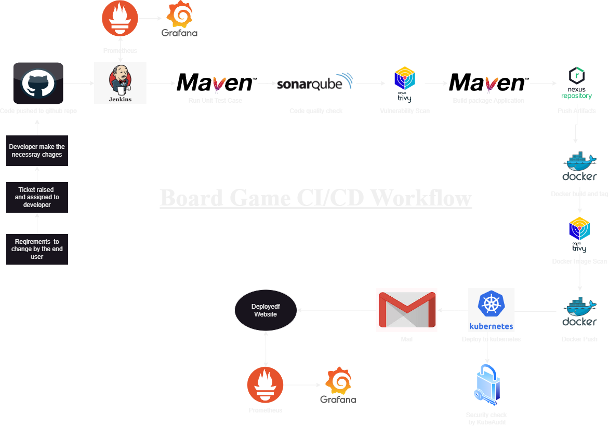

# BoardgameListingWebApp

## Description

**Board Game Database Full-Stack Web Application.**
This web application displays lists of board games and their reviews. While anyone can view the board game lists and reviews, they are required to log in to add/ edit the board games and their reviews. The 'users' have the authority to add board games to the list and add reviews, and the 'managers' have the authority to edit/ delete the reviews on top of the authorities of users.  

# Implementation PDF: [Click here! ](https://drive.google.com/file/d/1y45F4drh8qJTG7sIcsJ33KcGZyKKLJoF/view?usp=sharing)
The application was deployed on AWS using Kubernetes for orchestration, with Calico networking and NGINX Ingress Controller managing traffic. Security was ensured with Kubeaudit. SonarQube and Nexus servers were employed for code quality and artifact management. Jenkins orchestrated continuous integration and deployment. Prometheus, Grafana, and Black Box Exporter monitored performance and provided insights.

## Architecture Diagram

  

# Project Steps:

1. **Configure Private Environment through VPC and Security Group in AWS:**
   - Set up a Virtual Private Cloud (VPC) in AWS.
   - Configure security groups to control inbound and outbound traffic to the VM instances.

2. **Configure VMs:**
   - Launch three VM instances: one for Kubernetes cluster master and two for slave nodes.
   - Assign appropriate roles and permissions to these instances.
   - Install Kubernetes on all VMs.

3. **Deploy Kubernetes Cluster:**
   - On the master instance, initialize the Kubernetes cluster using `kubeadm init` command.
   - Join the slave nodes to the cluster using `kubeadm join` command.

4. **Deploy Networking Solution and Ingress Controller on Master Node:**
   - Deploy Calico networking solution and NGINX Ingress Controller on the master node.
   - Configure networking and routing accordingly.

5. **Install Kubeaudit for Cluster Security:**
   - Install Kubeaudit to ensure cluster security.
   - Run Kubeaudit to get reports on the cluster's security posture.

6. **Create SonarQube and Nexus Servers:**
   - Set up SonarQube and Nexus servers.
   - Connect to these servers from the VM instances.
   - Install Docker on each VM instance.

7. **Run SonarQube and Nexus Containers:**
   - Run SonarQube container on port 9000 and Nexus container on port 8081 within Docker.
   - Ensure proper configurations and mappings for these containers.

8. **Create Jenkins Server:**
   - Set up a Jenkins server.
   - SSH into the server.
   - Install Jenkins and configure it to run on port 8080.

9. **Build Jenkins Pipeline:**
   - Define a pipeline in Jenkins using Pipeline Syntax.
   - Include stages for building, testing, and deploying the application.
   - Ensure the pipeline executes successfully.

10. **Access the Board Game Application:**
    - Access the deployed application through appropriate endpoints.
    - Verify functionality and accessibility.

11. **Setup Prometheus, Grafana, and Black Box Exporter:**
    - Install Prometheus on port 9090, Grafana on port 3000, and Black Box Exporter on port 9115 on the cluster.
    - Configure Prometheus to scrape metrics from the application components.
    - Configure Grafana to visualize metrics collected by Prometheus.

12. **Monitor Jenkins using Grafana Dashboard:**
    - Download Node Exporter to monitor Jenkins on port 9100.
    - Configure Grafana to display Jenkins-related metrics.
    - Use Grafana dashboard to monitor Jenkins performance and health.
